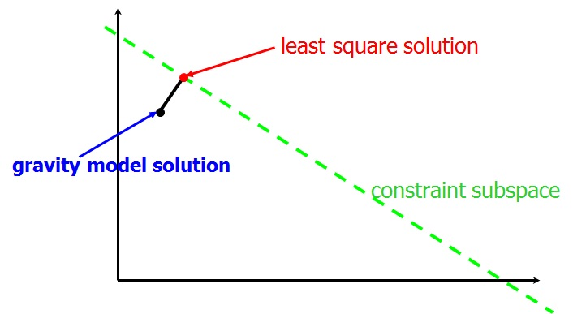
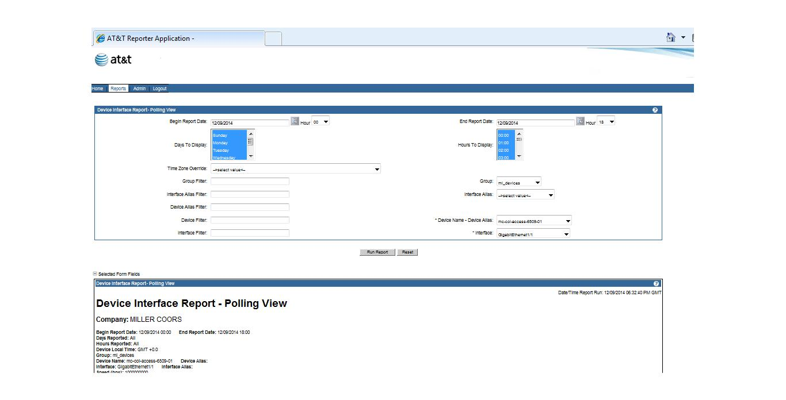
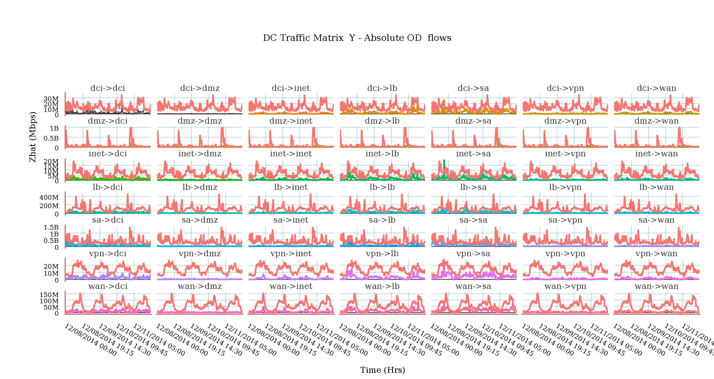
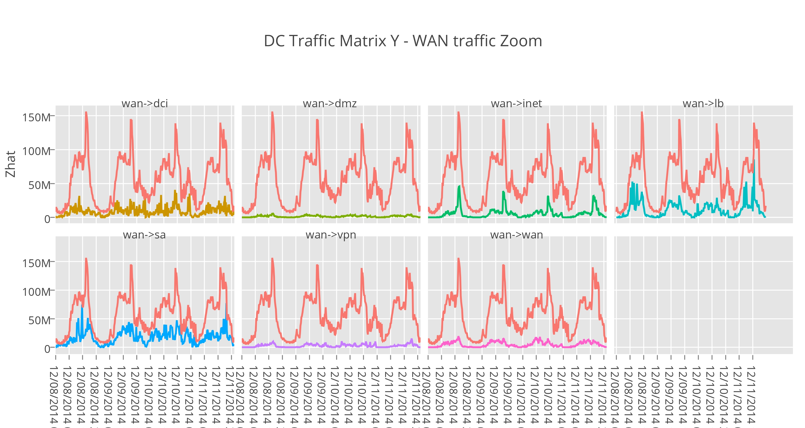
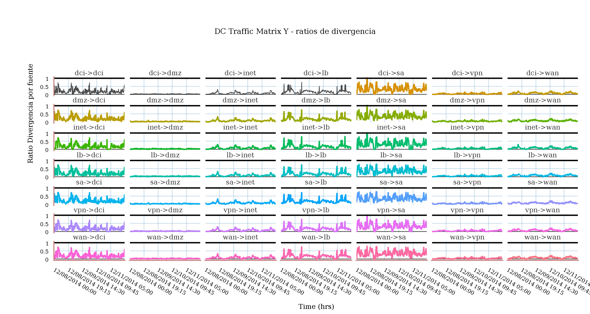
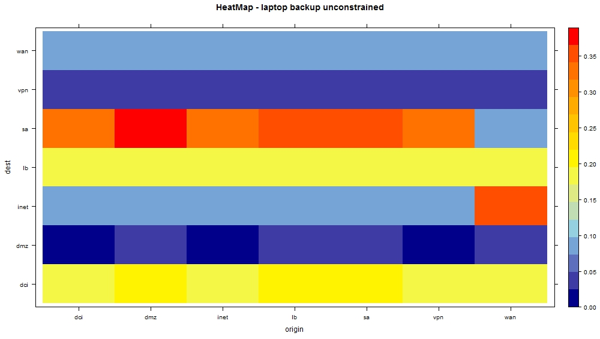
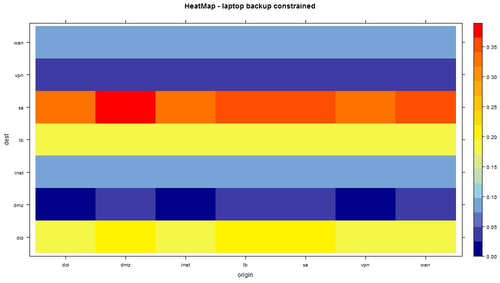

<style>
.reveal h1 {
    font-size: 2em;
    text-align: left;
    padding-bottom: 18px;

}

.reveal h2 {
    font-size: 1.5em;
    text-align: left;
    padding-bottom: 14px;

}

.reveal h3 {
    font-size: 0.75em;
    text-align: left;
    padding-bottom: 8px
}
</style>
---

# Traffic Matrix Estimation
## TM applied to a managed DC
### Patricio Villar

--- 

## Introduction
<hr>

> * A traffic matrix is a tool used by network architects for network management and capacity planning.
> * Taken together with network topology, routing and fault data; the TM can provide a great deal of help in the diagnosis and management of network congestion.
> * On longer scales, traffic matrices are critical inputs to network design, capacity planning and business planning.

---

## What does a TM provide?
<hr>

### "For every ingress point i into the network and egress point j out of the 

### network, the volume oftraffic T(i,j) from i to j over a time interval."

---

## Methods to Effectively Compute TMs
<hr>
> * Gravity Models
> * Generalized Gravity Models
> * Tomo-Gravity Models

---

## Tomogravity explained
<hr>

> * "Tomo-gravity" = tomography + gravity modeling
> * Exploits topological equivalence to restrict problem size
> * Use of least squares to get the solution:



---

## Tomogravity Model Applied
<hr>
> * In gral, there are not enough constraints: O(N) vs. O(N^2)
> * Constraints give a subspace of possible solutions
> * Constraints sub-space: Y = A * x + e; where x is the estimated TM
> * Finds a solution that satisfies the constraint AND is close to the Gravity model (Kullback-Lieber distance)
> * Orders of residuals "e" around 0.1. Tested in the Internet2 Abilene network.

---

## Where do we get Y?
<hr>


> * VPR scheduled reports can provide link loads!!!

---

## Data Tyding:
<hr>
> * VPR data must be rolled up.
> * In general, it provides tidy data. There are some exceptions though.
> * good deck on tidy data on http://www.stat.ucla.edu/~nfultz/tidy.html - Neal Futz (UCLA)

---

## Create a simple model of your network:
<hr>

```{r echo = F}
library(igraph)
g <- graph.formula(CORE++SA,CORE++WAN,CORE++DCI,CORE++DMZ,CORE++INET,CORE++VPN)
plot(g, vertex.size=40, vertex.color="grey", vertex.label.color="black")
```

---

### Calculate and Visualize your TM:
<hr>

    https://plot.ly/5/~pato23arg/

---

### Calculate and Visualize your TM (Cont'ed):
<hr>

    https://plot.ly/6/~pato23arg/

---

### Calculate and Visualize your TM (Cont'ed):
<hr>

    https://plot.ly/7/~pato23arg/

---

### Tshoot with Heat Maps:
<hr>


---

### Tshoot with Heat Maps (Cont'ed):
<hr>


---

## Further Applications:

> * Network Anomography: Detect anomalies using traffic matrix time and spatial series. 

> * Best paper in research.att.com ("Network Anomography: Robust, General Network-Level Anomaly Inference" - Zhang, Ge, Greenberg, Roughan)

---

## Biblio:
> * Information, Gravity and Traffic Matrices, NISS Internet Tomography Technology Workshop, March 28th, North Carolina, 2003. Matthew Roughan
> * Traffic matrix estimation on a large IP backbone, A Gunnar, Mikael Johansson, and Thomas Telkamp, Internet Measurement Conference 2004.
> * Time-Varying Network Tomography: Router Link Data, Jin Cao, Drew Davis, Scott Vander Wiel and Bin Yu, Journal of the American Statistical Association, Vol. 95, No. 452 (Dec., 2000), pp. 1063-1075.
> * Statistical Analysis of network data. J. Kolaczyk (Jan 2014)

---

## QA
<hr>

