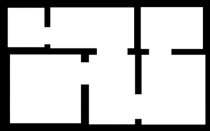
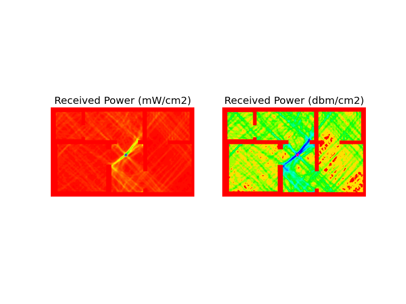
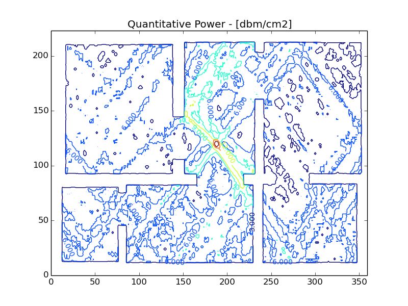

---

# EM wave simulator
## Introduction and Use cases
### Patricio Villar

--- 

## Motivation

> * Site surveys require planning and resource allocation ahead of time, even for the simplest propagation footprint.
> * Avoiding a site survey might end up in coverage holes (bad source distribution) or hidden interference sources (rogue EM sources), which lead to bad user experience.
> * Site surveys determine required hardware at the design stage, so it's a mandatory task before procurement.

---

## How do we simulate a EM standing wave field?

### Take Maxwell's equations in the presence of nonmagnetic matter, and the constitutive relations as follows:

\begin{eqnarray}
\nabla \cdot \mathbf{D} &=& 0 \\\
\nabla \cdot \mathbf{B} &=& 0 \\\
\nabla \times \mathbf{E} &=& -\frac{\partial\mathbf{B}}{\partial t} \label{eqn:faraday} \\\
\nabla \times \mathbf{H} &=& \mathbf{J} + \frac{\partial\mathbf{D}}{\partial t} \\\
\mathbf{D} &=& \epsilon_0\epsilon_r\mathbf{D} \\\
\mathbf{H} &=& \frac{1}{\mu_0}\mathbf{B}
\end{eqnarray}

---

## How do we simulate a EM standing wave field? Cont'ed

### Substituting everything in for Eq.:

$\nabla \times \mathbf{E} &=& -\frac{\partial\mathbf{B}}{\partial t} \label{eqn:faraday}$

### and assuming that:

$\partial/\partial t \rightarrow i\omega$

---

## How do we simulate a EM standing wave field? Cont'ed

 
### We get the following:

$$latex
\begin{equation}
\left(\nabla^2 + n^2k0^2\right)\mathbf{E} + \nabla\left(\frac{1}{n^2}\left(\mathbf{E}\cdot\nabla n^2 \right) \right) = \mu_0i\omega_0\mathbf{J}
\end{equation}
$$

where $n(x,y) = \sqrt{\epsilon_r}$ is the refractive index and $(\omega_0, k_0)$ are the frequency and vacuum wavevector of the radiation, related by $\omega_0 = ck_0$. In the presence of matter, the radiation field keeps the same frequency but the wavevector changes to $k(x,y) = nk_0$, causing refraction, reflection etc.

---

## Application details

> * A floor map is required to start the simulation.
> * The floor map should be color-coded, in order to differentiate materials (and therefore their respective refractive index) - air, concrete, wooden walls are valid examples.
> * Algorithm complexity is m x n, so ~ to wave resolution.

---

## Application output: Qualitative

> * This plot can be used as a rough aproximation for AP placement:

---

## Application output: Quantitative

> * This contour plot can be used to quantify coverage holes size and impact.

---

## Future Enhancements:

> * Multiple AP capability. (algorithm complexity increases to N x m x n)
> * Multi-Threading and Grid support.
> * Support for directional and quad antenas.
> * GUI interface with Tk.

---

## Biblio:
> * Computational Electromagnetics - Rylender, Bondenson, Ingelstrom.
> * Computational Electrodynamics: The FDTD method - A. Taflove
> * Computational Electromagnetics for RF and Microwave Engineering - D. Davidson.

---

## QA

